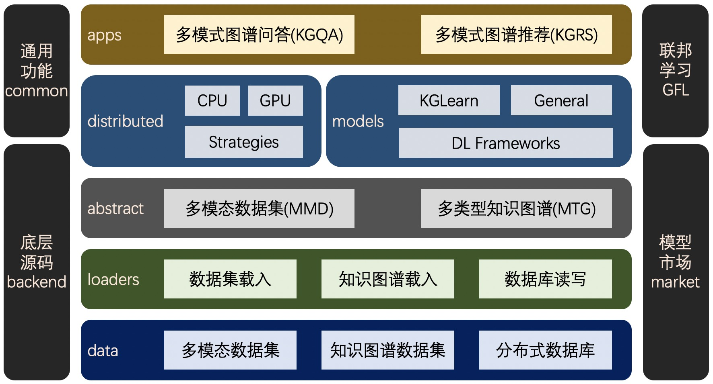

# OpenKS - A Domain Generalized Knowledge Computing Platform

## 平台支持功能
| 基础能力 | 领域泛化能力 | 跨领域能力 | 现实问题解决能力 | 开放服务使用能力 |
| :----: | :----: | :----: | :----: | :----: |
| 知识图谱载入与构建 | 领域启发式知识表示处理与推理应用 | 跨领域知识融合表示学习与推理 | 大规模高效率知识图谱学习与推理 | 前沿算法集成与高性能模型调用 |
| 知识图谱表示与学习 | 通用分布式知识表示学习与推理应用 | 跨模态知识统一表示学习与推理 | 隐私安全知识图谱联合学习与推理 | 典型知识图谱应用系统开发使用 |
| 知识图谱推理与应用 |  |  |  | 领域场景高质量开放数据集提供 |

## 模块架构


## 环境要求
- Python 3.x
- 百度飞桨Paddle(https://github.com/paddlepaddle/paddle)
- PyTorch(https://github.com/pytorch/pytorch)
- NumPy(https://github.com/numpy/numpy)
- scikit-learn(https://github.com/scikit-learn/scikit-learn)
- py2neo(for KGQA application with graph database)(https://pypi.org/project/py2neo/) - 2020.7b8 版本以上
- pyahocorasick(for KGQA application with graph database)(https://pypi.org/project/pyahocorasick/)

## 快速上手
### 知识计算全流程一键测试（数据载入 - 图谱生成 - 模型训练 - 问答推荐）
```
python main.py
```

#### 分布式图表示模型训练
```
python openks/distributed/openKS_launcher.py --mode cpu --worker_num 2 --server_num 2 main_dist.py
```

### 使用说明
1. 图谱数据载入与图谱结构生成
```
# 使用loader_config配置数据载入参数，包括数据来源（本地文件/图数据库）、数据文件格式类型（OpenKS格式/压缩目录）、文件路径、数据集名称等
from openks.loaders import *
loader_config.source_type = SourceType.LOCAL_FILE
loader_config.file_type = FileType.OPENKS
loader_config.source_uris = 'openks/data/medical'
loader_config.data_name = 'test-data-set'
```
```
# 数据文件载入为内存数据集格式，并进行数据集信息展示
loader = Loader(loader_config)
dataset = loader.dataset
dataset.info_display()
```
```
# 知识图谱数据内存数据格式载入，并进行图谱信息展示（可以不进行数据集载入而直接进行图谱载入）
graph_loader = GraphLoader(loader_config)
graph = graph_loader.graph
graph.info_display()
```
```
# 可以将内存图谱数据写入neo4j图数据库中用于下游任务
from py2neo import Graph
graph_db = Graph(host='127.0.0.1', http_port=7474, user='neo4j', password='123456')
graph_loader.graph2neo(graph, graph_db, clean=False) # clean为False表示不进行清空，True为清空并重新导入
```
2. 图谱表示学习模型训练
```
# 列出已注册的所有算法模型
from openks.models import *
OpenKSModel.list_modules()
```
```
# 算法模型选择配置，包括框架选择、模型大类选择、算法选择等
platform = 'Paddle'
model_type = 'KGLearn'
model = 'TransE'
```
```
# 算法模型加载与训练（如需要分布式训练，需配置run方法的参数，如run(dist=True)）
model_type = OpenKSModel.get_module(platform, model_type)
kgmodel = model_type(graph=graph, model=OpenKSModel.get_module(platform, model), args=None)
kgmodel.run(dist=False)
```
3. 知识图谱问答
```
# 选择自定义的问题解析类并进行规则和模型预加载
parser = RuleParserMedical(graph)
```
```
# 输入问题并对问题进行结构化解析
question = input("输入问题：")
struc_q = parser.parse(question)
```
```
# 根据结构化问题获取答案，支持直接内存数据匹配、外部数据库查询、图谱向量表示计算等方式
fetcher = AnswerFetcher(struc_q, graph)
print(fetcher.fetch_by_db_query(graph_db))
```

## 系统逻辑

