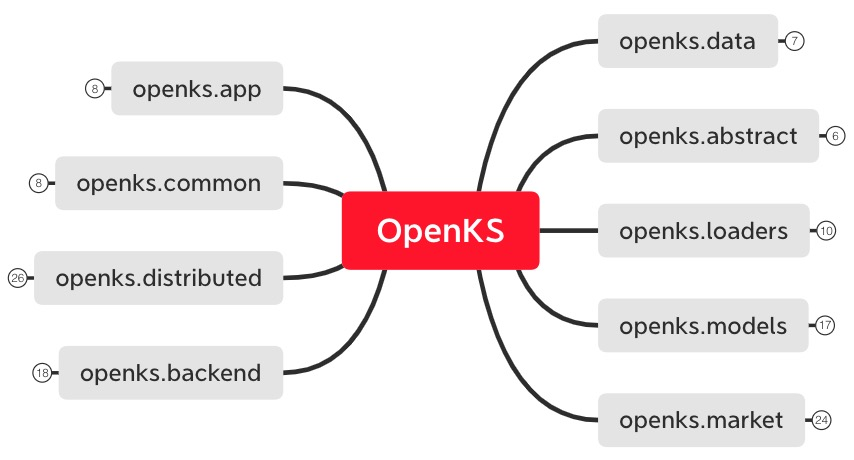

# OpenKS核心框架

## 整体模块逻辑图

## 模块说明

* data模块：统一格式开放知识图谱数据集，系统标准输入
* abstract模块：OpenKS内部数据格式抽象，包括多模态数据MMD和多类型图谱MTG
* loaders模块：数据载入方法，包括多模态数据载入和多类型图谱载入及数据库操作
* models模块：OpenKS模型抽象，注册式模型声明与多框架模型开发接口及规范
* market模块：开放模型市场，高性能图谱构建与表示推理模型开放接口服务
* backend模块：OpenKS底层核心算法框架，支撑大规模分布式图计算与推理模型资源调度
* distributed模块：分布式模型训练使用接口，支持开源框架分布式训练与优化后的接口
* common模块：公共功能方法，如模型注册中心，通用处理逻辑等
* app模块：OpenKS应用示例封装，包括基于知识图谱的问答和推荐等应用demo及开发接口