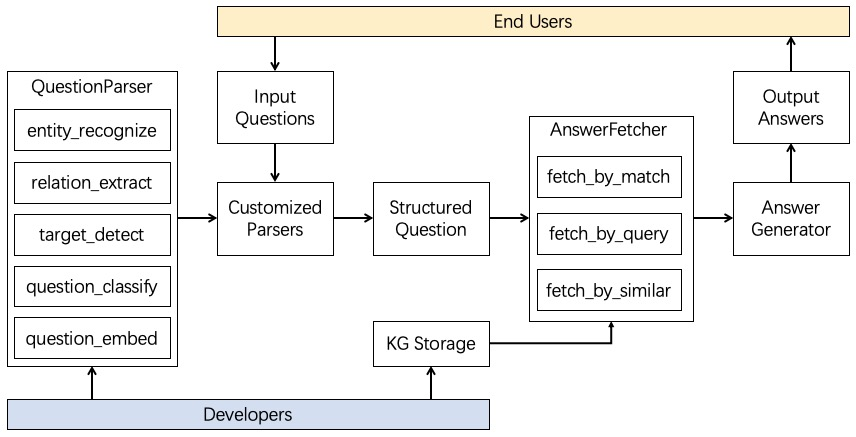
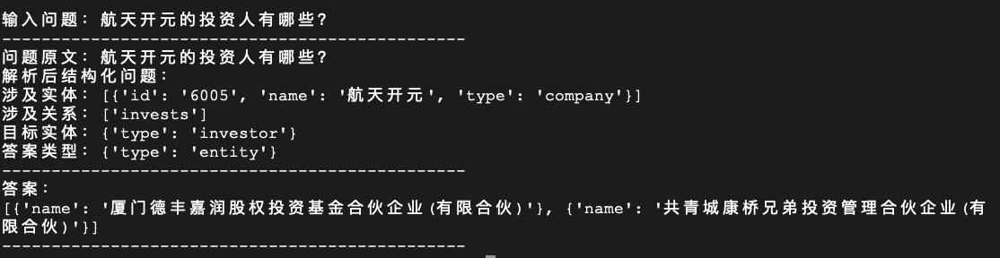
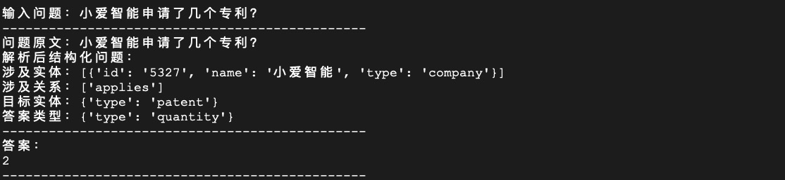
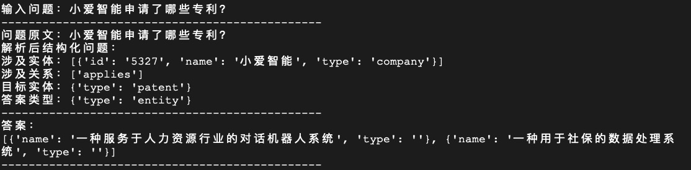
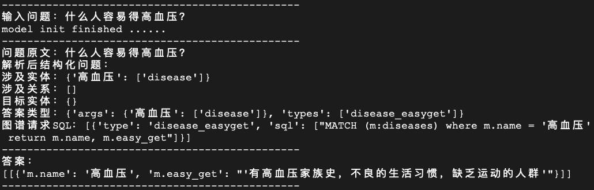
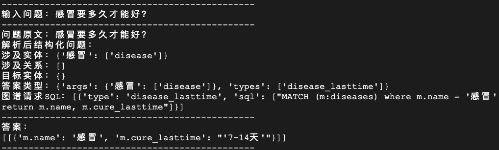

# 知识问答demo

## OpenKS问答流程图：

### 支持基于知识库匹配方式的问答搜索流程，效果如下：
#### 企业投融资与知识产权数据集（来自内部构建）
* 
* 
* 

### 支持基于知识图谱数据库查询方式的问答搜索流程，效果如下：
#### 医疗健康数据集（来自：https://github.com/liuhuanyong/QASystemOnMedicalKG）
* 
* 

### 实现一个基于规则的知识图谱问答流程：
1. 按照OPENKS的输入数据格式构建知识图谱数据集并放入openks/data/中，可参考[此文档](https://github.com/ZJU-OpenKS/OpenKS/blob/master/openks/data/README.md)
2. 需自定义编写问题解析脚本类，该类需继承`QuestionParser`，实现其中定义的处理模块，如实体抽取、关系抽取、模板识别、问题类型等，并通过`parse`函数组装各个模块并返回`StrucQ`结构化问题，可参考`rule_parser.py`中的解析示例
3. 在主方法main.py中声明问题解析类进行模型预加载，并调用自定义解析类的parse方法进行问题解析，之后调用`AnswerFetcher`的`fetch_by_matching`方法（直接匹配MTG图）或`fetch_by_db_query方法`（执行数据库查询），即可实现一个简单的知识库匹配式问答

### 支持基于知识图谱向量表示计算的问答计算流程：
#### 参考论文：Huang, Xiao, et al. "Knowledge graph embedding based question answering." 
1. 在models模块中选择所使用的框架目录下（如PyTorch）定义算法模型，用于识别问题中的实体和实体到向量的表示，如[模型示例](https://github.com/ZJU-OpenKS/OpenKS/tree/master/openks/models/pytorch)
2. 自定义基于算法模型的问题解析类，继承`QuestionParser`，定义实体抽取、实体向量化、关系向量化等方法，构建`StrucQ`结构化问题对象
3. 调用`AnswerFetcher`的`fetch_by_similarity`方法，实现基于实体和关系向量计算的目标答案获取（部分内部方法尚未实现）