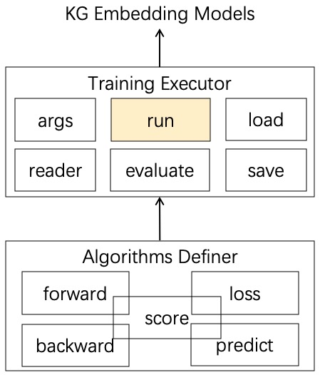

# OpenKS模型开发与使用说明

## OpenKS模型开发封装示意图：

## 开发者模式
* 支持多种深度学习框架的模型开发与集成，目前支持：
	- PyTorch
	- PaddlePaddle
* 参考`model`脚本，在对应的框架目录中定义模型及运行逻辑，支持的模型有：
	- 模型执行类
		| 注册名称 | 用途 | 继承父类 |
		| :----: | :----: | :----: |
		| KGLearn | 针对知识图谱表示学习的执行类 | KGLearnModel |
		| general | 针对其他一般深度学习模型训练的执行类 | GeneralModel |
	- 模型核心算法类
		| 注册名称 | 用途 | 支持框架 |
		| :----: | :----: | :----: |
		| TransE | TransE算法图谱表示学习 | Paddle/PyTorch |
		| TransH | TransH算法图谱表示学习 | PyTorch |
		| TransR | TransR算法图谱表示学习 | Paddle/PyTorch |
		| GCN | GCN算法图表示学习 | Paddle/PyTorch |
		| entity-extract| 文本实体识别抽取 | Paddle/PyTorch |
		| question-embedding | 文本问题嵌入表示 | PyTorch |

* 模型运行类用于数据预处理、数据载入框架、模型评估逻辑、模型保存与读取、模型运行等
* 模型算法类用于实现针对不同算法框架的算法逻辑、损失计算、反向传播等
* 模型运行类和模型算法类需利用装饰器注册到Register中，才能在使用者模式中调用，注册时需指明模型名称和所用框架名称（Paddle/PyTorch）
* 如需要支持分布式训练，则模型运行类和模型算法类的定义需要针对分布式做处理，可参考`paddle/kglearn.py`中`run`方法和`paddle/TransE.py`中`backward`方法的写法

## 使用者模式
* 以`OpenKSModel`类作为模型载入接口，可使用`list_module`函数显示所有已注册的模型名称和所用框架
* 需要指明所调用模型的框架名称、模型运行类名称、算法名称等信息，利用`OpenKSModel`的`get_module`方法载入模型
* 载入的已注册算法模型作为参数传入模型运行类中，同时传入`MTG`图谱数据，调用`run`方法，完成模型的训练、评估与测试
* 分布式训练模式的用户可通过调用`run(dist=True)`方法轻松实现
* 具体用法可参考项目根目录下的`main.py`和`main_dist.py`脚本