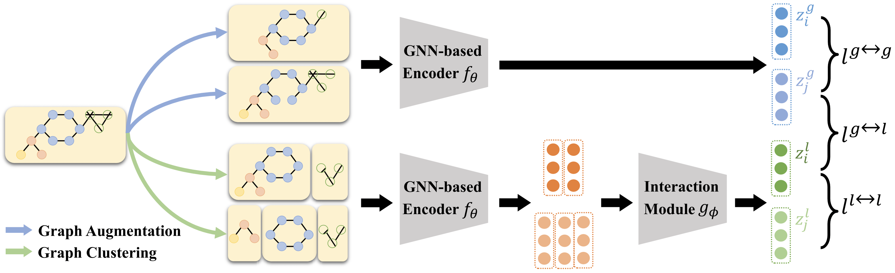

# 图谱表征算法CLEAR说明文档

### 流程图



### 算法描述
| 算法名称  | 算法功能 | 实现框架 |
|:-----:|:----:| :------: |
| CLEAR | 图谱表征 | PyTorch  |

+ 包含子图结构的多层次信息融合表征框架，有助于深层次地探索图语义知识，提高推理精度。

### 环境配置

- Cuda版本：10.2
- python==3.7.10
- 其他依赖库的安装命令如下：

```shell
conda install pytorch==1.8.0 torchvision==0.9.0 torchaudio==0.8.0 cudatoolkit=10.2 -c pytorch
pip install https://data.pyg.org/whl/torch-1.8.0%2Bcu102/torch_cluster-1.5.9-cp37-cp37m-linux_x86_64.whl
pip install https://data.pyg.org/whl/torch-1.8.0%2Bcu102/torch_scatter-2.0.7-cp37-cp37m-linux_x86_64.whl
pip install https://data.pyg.org/whl/torch-1.8.0%2Bcu102/torch_sparse-0.6.10-cp37-cp37m-linux_x86_64.whl
pip install https://data.pyg.org/whl/torch-1.8.0%2Bcu102/torch_spline_conv-1.2.1-cp37-cp37m-linux_x86_64.whl
pip install torch_geometric==1.7.2
pip install scikit-learn==0.24.2
```

### 运行示例
在  `IMDB-BINARY`  数据集上训练和测试，请使用以下命令：
```shell
python main.py --DS IMDB-BINARY
```
更多参数请参考 `arguments.py` 或者使用以下命令：
```shell
python main.py -h
```

可选数据集包括`PROTEINS`, `DD`, `IMDB-BINARY`, `IMDB-MULTI`, `REDDIT-BINARY`, `REDDIT-MULTI-5K`, `COLLAB`。