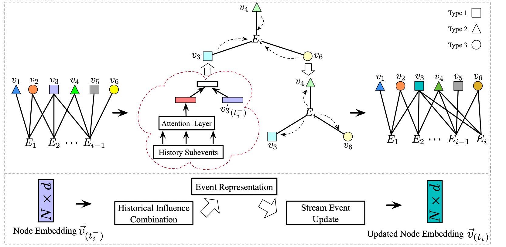

# 异质图演化模型HE-SNE说明文档

## 算法流程图



## 1. 算法描述

基于TensorFlow实现了异质图演化模型HE-SNE，其可以通过用户的历史行为序列以及商品列表构建异质图并进行相应推荐。

## 2. 依赖及安装

- Cuda版本：11.0
- Python版本: >=3.7
- 其他依赖库：
  - networkx==2.4
  - scikit-learn==0.21.1
  - scipy==1.4.1
  - tensorflow-gpu==2.3

也可访问管理平台页面下载.whl文件手动安装。

## 3. 运行示例

```python
import sys, traceback, pdb
from models.gnn_eventsuccess_withattention_ind import GnnEventModel_withattention_ind
from models.gnn_eventsuccess_withattention import GnnEventModel_withattention
from models.gnn_eventsuccess_withattention_rev import GnnEventModel_withattention_rev
from models.gnn_eventsuccess_withattention_old import GnnEventModel_withattention_old
from models.gnn_eventsuccess_withattention_new import GnnEventModel_withattention_new
from models.gnn_eventsuccess_withattention_noeventupdate import GnnEventModel_withattention_noeventupdate
from models.gnn_eventsuccess_withattention_nohisupdate import GnnEventModel_withattention_nohisupdate
from models.gnn_eventsuccess_withoutupdate import GnnEventModel_withoutupdate
from models.gnn_eventsuccess_withattention_reco import GnnEventModel_withattention_reco
from docopt import docopt


def main():
    args = docopt(__doc__)
    try:
        model = GnnEventModel_withattention_rev(args)
        model.train()
    except:
        typ, value, tb = sys.exc_info()
        traceback.print_exc()
        pdb.post_mortem(tb)
```

## 4. 运行方法


```shell
./train.sh
```

## 5. 论文/专利引用

Y. Wang, J. Shen, Y. Song, S. Wang and M. Zhang, "HE-SNE: Heterogeneous Event Sequence-based Streaming Network Embedding for Dynamic Behaviors," 2022 International Joint Conference on Neural Networks (IJCNN)

## 6. 其他